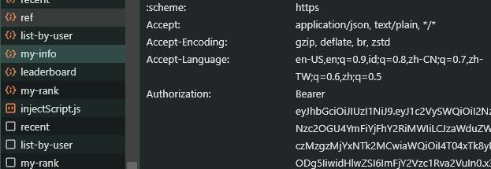

# UNICH AUTO MINING 


## Features

- **Auto Complete Tasks**
- **Auto Start Mines Daily**
- **Support Multy Accounts**

## Requirements

- **Node.js**: Ensure you have Node.js installed.
- **npm**: Ensure you have npm installed.

## register/login 
- go to here [https://unich.com/en/airdrop](https://unich.com/en/airdrop/sign-up?ref=K0GD0Q) to register or login
- F12 to inspect after you login to get token 
- copy your token and paste to `tokens.txt`


## Setup

1. Clone this repository:
   ```bash
   git clone https://github.com/rmndkyl/unich-bot.git
   cd unich-bot
   ```
2. Install dependencies:
   ```bash
   npm install
   ```
3. Setup: input token token tokens.txt
   ```bash
   nano tokens.txt
   ```
4. Run The Script:
   ```bash
   npm run start
   ```


## 

This project is licensed under the [MIT License](LICENSE).
